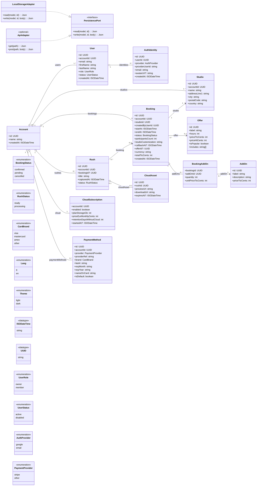
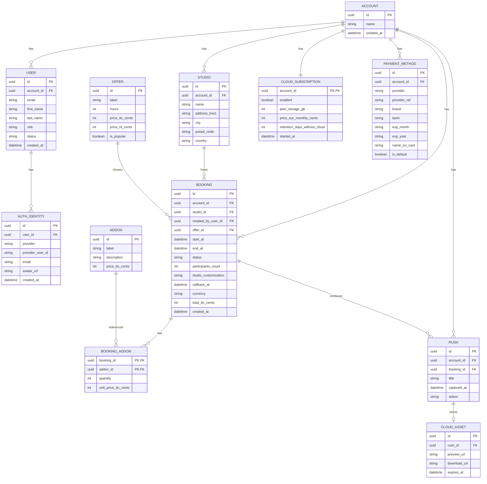
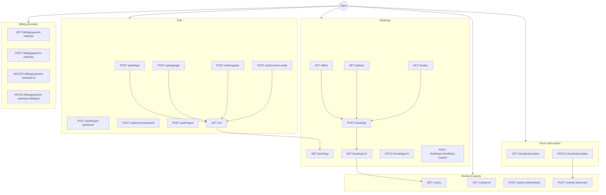

# Spécification backend (proposée) — Branddeo Client Dashboard

Ce dépôt est un frontend (pas d’API/DB). Le document ci-dessous est une **spécification backend déduite** à partir des écrans et des use cases implémentés dans le code : réservations (wizard), rappel, options, cloud, rushes, facturation (UI), auth (email + Google mock).

Objectif : fournir au développeur backend un **modèle de domaine** + une **base DB (ERD)** + un **contrat d’API** cohérents avec l’UI actuelle.

## Diagramme de classes (Mermaid) — Modèle de domaine backend

## ERD (Mermaid) — Schéma DB minimal (backend-ready)

## Use cases (Mermaid) — Backend (endpoints attendus)

## Notes d’implémentation backend (points clés)
- Payment methods : ne jamais stocker le numéro de carte. Stocker un `provider_ref` (ex: Stripe PM id) + métadonnées (brand/last4/expiry).
- Booking “callback” : modélisé par `callback_at` (datetime) optionnel sur `booking`.
- Cloud preview : `CloudSubscription.enabled` pilote l’accès aux `CloudAsset.preview_url`.
- Rétention : `retention_days_without_cloud` (ex: 7 jours) sert à expirer les assets si cloud désactivé.
